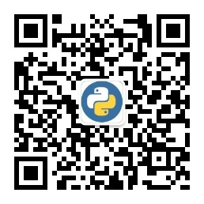

# machine_learning_book

@Author：Runsen

> 人生最重要的不是所站的位置，而是内心所朝的方向。只要我在每篇博文中写得自己体会，修炼身心；在每天的不断重复学习中，耐住寂寞，练就真功，不畏艰难，奋勇前行，不忘初心，砥砺前行，人生定会有所收获，不留遗憾 （作者：Runsen）

机器学习从入门到实战（书籍）

本书分为三个部分：

- 第一和第二章是机器学习中的入门篇，主要介绍了机器学习的概念、Python开发环境的搭建以及机器学习中所必备的数学知识，线性代数和概率论。
- 第三章到第十二章是机器学习中的基础篇，主要介绍了回归模型，分类模型，聚类模型和半监督模型的建立和相关算法的理论，以及如何使用sklearn具体实现相关算法模型的搭建。
- 第十三章和第十四章是机器学习的扩展篇，介绍了R语言和Spark机器学习。笔者认为对于机器学习，不能只限于Python语言的学习，还要跟进大数据的时代的发展。

# 书籍目录

| 章节                       | 要点                                                 |
| :------------------------- | :--------------------------------------------------- |
| 第一章  走进机器学习的世界 | 机器学习概念、Python环境搭建、求导和积分             |
| 第二章  线性代数和概率论]  | 向量和矩阵线性运算、离散型和连续型随机变量和概率分布 |
| 第三章 数据获取和预处理    | 数据预处理、特征处理、文本和图片特征提取和特征选择   |
| 第四章  线性回归和逻辑回归 | 最小二乘法、Lasso回归、岭回归、多项式回归和逻辑回归  |
| 第五章  KNN和贝叶斯分类    | KNN算法、KD树、三大朴素贝叶斯                        |
| 第六章  决策树和随机森林   | 决策树算法、随机森林                                 |
| 第七章 支持向量机          | 线性可分、核函数和SVM。                              |
| 第八章 聚类                | K-Means聚类算法、层次聚类算法聚类和密度聚类算法。    |
| 第九章  EM和HMM聚类算法    | EM算法原理、隐马尔科夫模型                           |
| 第十章 主题模型            | LDA主题模型、自然语言处理                            |
| 第十一章 推荐算法          | 关联规则的三大指标、矩阵分解算法和SlopeOne算法       |
| 第十二章 数据建模          | 监督回归、分类模型、半监督分类和模型的保存           |
| 第十三章 R语言机器学习     | R语言机器学习                                        |
| 第十四章  Spark机器学习    | Spark机器学习                                        |

# 联系与交流

- 微信：RunsenLiu

- [作者CSDN博客](https://blog.csdn.net/weixin_44510615)

- 作者微信公众号：

